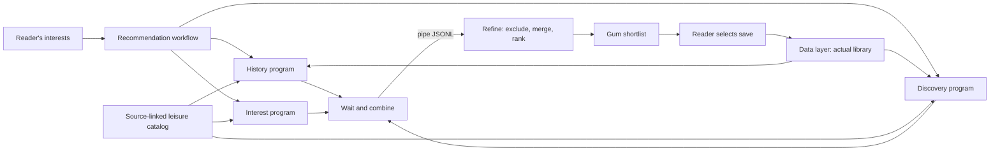

# File responsibilities

All application files are under `book-manager/`.

| File | Input → output; responsibility |
| --- | --- |
| `app.sh` | Launch options → main menu; checks dependencies and sets up isolated demo data |
| `ui/main_menu.sh` | Gum selection → appropriate screen |
| `ui/library_screen.sh` | Reader input/selection → library workflow calls and book details |
| `ui/recommendations_screen.sh` | Reader interests → progress, shortlist, and save selection |
| `ui/helpers.sh` | Records → reusable display and selection; avoids duplicated UI code |
| `workflows/manage_library.sh` | Library action → appropriate book/data component; selects fields before persistence |
| `workflows/get_recommendations.sh` | Interests → three parallel strategies, synchronization, pipe, refined JSONL |
| `books/fetch_book_metadata.sh` | Title and optional author → metadata candidates for human selection |
| `books/search_books.sh` | Argument or stdin search term → matching saved books via data layer |
| `books/catalog.sh` | List/search action → source-linked external metadata; owns live lookup and cache |
| `recommendations/recommend_from_history.sh` | Actual library plus catalog → candidates based on author, genre, and subjects; low ratings excluded |
| `recommendations/recommend_from_interests.sh` | Interest terms plus catalog → matching candidates and reasons |
| `recommendations/recommend_for_discovery.sh` | Library/interests plus catalog → other literary genres |
| `recommendations/refine_recommendations.sh` | Candidate JSONL on stdin → deduplicated shortlist excluding saved books |
| `data/book_database.sh` | Operation plus arguments/JSON → validated persisted records; sole personal CSV owner |
| `data/books.csv` | Persistent personal library; starts with a header only |
| `data/catalog.jsonl` | Bundled external metadata; a candidate pool, never claimed reading history |
| `config/interests.txt` | Editable default interest terms |
| `examples/demo_library.jsonl` | Clearly labeled fictional reading states on real books for an isolated demonstration |
| `lib/common.sh` | Shared paths, environment defaults, and dependency checks |

## Trace: add a book

1. `app.sh` opens the main menu. The reader selects **Add Book**.
2. The library screen asks for a title and optional author. It calls
   `manage_library.sh lookup`, which calls `fetch_book_metadata.sh`.
3. The metadata component delegates to the external catalog. A live Open Library
   search, cached response, or bundled fallback emits JSONL candidates.
4. The reader selects the correct work, then chooses reading status and ownership.
   A missing genre is chosen by the reader. Manual entry is available if lookup fails.
5. `manage_library.sh add` selects only persistent library fields, then pipes the
   record to `book_database.sh add`.
6. The data layer validates fields and duplicates, assigns a manual ID if needed,
   and atomically replaces the CSV. The saved record returns to the UI.

## Trace: get recommendations



The workflow starts each strategy in the background and stores its PID. It
reports progress, waits for each program, discards partial output from any failed
strategy, and pipes the successful outputs into refinement. Refinement removes
library matches and duplicates by work ID or normalized title plus author,
merges reasons, and balances familiar suggestions with one exploration slot.
An empty library supplies no history evidence. No personal reading record is
invented to make that strategy produce output.

The JSONL boundary makes components independently usable:

```bash
./book-manager/recommendations/recommend_from_interests.sh 'mystery,short stories' \
  | ./book-manager/recommendations/refine_recommendations.sh 3
```
